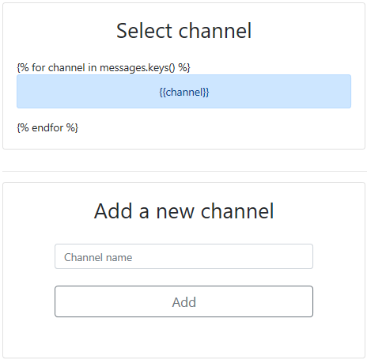
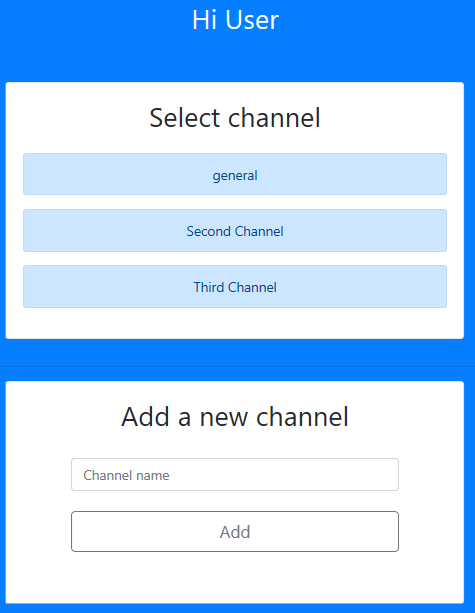
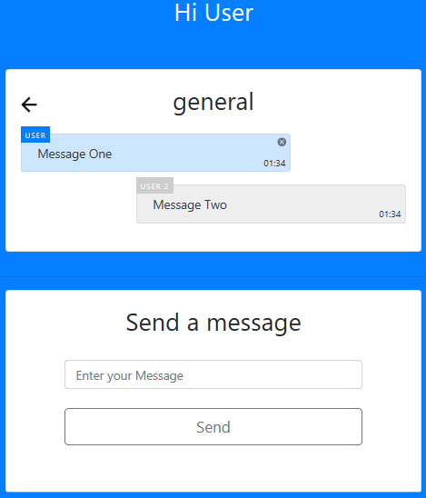

# **Chatterbox**

&nbsp;&nbsp;&nbsp;&nbsp;&nbsp;&nbsp;&nbsp;&nbsp;&nbsp;&nbsp;&nbsp;&nbsp;This project is a single-page online messaging service, using Python (3.7), Jinja2, Flask 'socketio,' HTML5, JavaScript(ES6 standards), Bootstrap (version 4), open source icons
(ionicons.com), popper.js and Cascading Style Shees (CSS3).

# **Functionality, Key components and Design**

&nbsp;&nbsp;&nbsp;&nbsp;&nbsp;&nbsp;&nbsp;&nbsp;&nbsp;&nbsp;&nbsp;&nbsp;This one page application consists of the application.py, index.html, script.js and style.css files.  The application is event driven. Event listeners in the script.js file define the changes to the index.html page. The event drivers below explain the functionality of this application and point out key components. The design choices for this application center on Bootstrap 4's grid, cards, and utilities components.

**Event One - document.addEventlListener(;DOMContentLoaded',()=>{}**

&nbsp;&nbsp;&nbsp;&nbsp;&nbsp;&nbsp;&nbsp;&nbsp;&nbsp;&nbsp;&nbsp;&nbsp;User visits web application for the first time. The index.html triggers the listening function in the script.js file.  It listens for the Document Object Model (DOM) content to load, and once loaded will trigger 'Event One.'  This event checks the following components to render the proper view for the user:

* Check the local storage to assure that no user 'name' is present
* Check if there is at least one 'channel'

&nbsp;&nbsp;&nbsp;&nbsp;&nbsp;&nbsp;&nbsp;&nbsp;&nbsp;&nbsp;&nbsp;&nbsp;If the above two components are false then the default index.html view displays the Welcome screen as shown below. The form shown below is within the bootstrap grid container with id = "nameForm"

&nbsp;&nbsp;&nbsp;&nbsp;&nbsp;&nbsp;&nbsp;&nbsp;&nbsp;&nbsp;&nbsp;&nbsp;Note:  Should the user click submit here and not enter a name, the bootstrap model relies on popper.js to pop up a message stating, 'this is a required field.'  Bootstrap 4 depends on JavaScript which uses popper.js.
See https://getbootstrap.com/docs/4.1/getting-started/javascript/

**Event Two - document.querySelector('#nameForm').addEventListener('submit',(event)=>{}**

&nbsp;&nbsp;&nbsp;&nbsp;&nbsp;&nbsp;&nbsp;&nbsp;&nbsp;&nbsp;&nbsp;&nbsp;User types a name in the 'Welcome' screen (#nameForm) and clicks the submit button. The #inputName is stored in local Storage and the functio switchToChannels() is called.  The submit button default event from HTML is prevented from running by using the event.preventDefault() function.

&nbsp;&nbsp;&nbsp;&nbsp;&nbsp;&nbsp;&nbsp;&nbsp;&nbsp;&nbsp;&nbsp;&nbsp;The switchToChannels() function switches the view to channels by changing the following attributes in the HTML document:

* The nameHeading class is changed to 'Hi'+ localStorage.getItem("name)
* The heading class is changed to 'Select channel'
* The id=nameForm view is set to not visible by adding the d-none utility in bootstrap. See reference at bootstrap about utilities https://getbootstrap.com/docs/4.0/migration/#utilities
* The chatrooms class is set to visible by removing the d-none utility in bootstrap
* The channelFormRow is set to visible by removing the d-none utility in bootstrap

&nbsp;&nbsp;&nbsp;&nbsp;&nbsp;&nbsp;&nbsp;&nbsp;&nbsp;&nbsp;&nbsp;&nbsp;The current_view is now 'channels.' Note that jinja2 displays all channels, and if no channels are stored, then 'general' is the default value as defined in the application.py file. As channels grow in number, bootstraps responsiveness keeps moving the channels down the page.

**Event Three - document.querySelector('#channelForm').addEventListener('submit',(event)=>{}**

&nbsp;&nbsp;&nbsp;&nbsp;&nbsp;&nbsp;&nbsp;&nbsp;&nbsp;&nbsp;&nbsp;&nbsp;The user types in a Channel name and clicks add.  The following happens:

* The channel name originates from the HTML document, and then sent through the socket "add channel" on the server.
* The add_channel function checks for duplicates and an error emits back to the client if there is a duplicate.
* If not a duplicate then the channel name passes the message to the clients.

&nbsp;&nbsp;&nbsp;&nbsp;&nbsp;&nbsp;&nbsp;&nbsp;&nbsp;&nbsp;&nbsp;&nbsp;Next 'Event One' triggers again after the Document is loaded.  This time there is a name in local storage and there is a channel name, so the switchToChannels function runs again and the channels are displayed one under each other on the grid. See illustration below.

**Event Four - channel.addEventListener('click',()=>{}**

&nbsp;&nbsp;&nbsp;&nbsp;&nbsp;&nbsp;&nbsp;&nbsp;&nbsp;&nbsp;&nbsp;&nbsp;The user clicks on one of the channels. The following happens:

* The heading class is changed to the channel name clicked on
* Current_channel is assigned the value of the channel chosen
* Do not display chatrooms
* Show message FormRow
* Show the chat messages
* Do not show the channelFormRow
* Show messagesFormRow
* Show the chat messages
* Show all child channels
* Assign the current_view = ‘chat’
* Set the channel name to channel

&nbsp;&nbsp;&nbsp;&nbsp;&nbsp;&nbsp;&nbsp;&nbsp;&nbsp;&nbsp;&nbsp;&nbsp;The view appears in the illustration below.

**Event Five – document.querySelector('#messageForm').addEventListener('submit', (event) => {}**

&nbsp;&nbsp;&nbsp;&nbsp;&nbsp;&nbsp;&nbsp;&nbsp;&nbsp;&nbsp;&nbsp;&nbsp;After the user inputs a message from a channel and clicks send, the message uses the socketio new message to transfer the message on the messageForm to the Server and broadcasts it to the clients.  After the message gets loaded onto the server (load message):

* The message gets stored in their appropriate channel
* The message sets attributes to identify the author, message, channel, and timestamp
* Classes are dynamically added to the div
* When receiving messages into the UI, JavaScript identifies who the message is from (message.author)
* If the author is equal to the locally stored author, then we identify the author with the class ‘self’
* If the message identifies with the ‘self’ class, then the message adds a ‘close button’ and the message floats left.  See picture above.
* If the message is not the author’s, then there is not a ‘close button’ added and the message floats right
* The display below highlights the design of the message display

**Event Six - document.querySelector('.back').addEventListener('click', () => {}**

&nbsp;&nbsp;&nbsp;&nbsp;&nbsp;&nbsp;&nbsp;&nbsp;&nbsp;&nbsp;&nbsp;&nbsp;When the user clicks the back arrow on the view, then the view changes back to the channelFormRow. The messages and messageFormRow are removed from the view.

**Event Seven - Delete Event**

**Card Body Design Choice**

**REQUIREMENTS**

**Documentation**