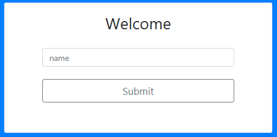

# **Chatterbox**

&nbsp;&nbsp;&nbsp;&nbsp;&nbsp;&nbsp;&nbsp;&nbsp;&nbsp;&nbsp;&nbsp;&nbsp;This project is a single-page online messaging service, using Python (3.7), Jinja2, Flask 'socketio,' HTML5, JavaScript(ES6 standards), Bootstrap (version 4), open source icons
(ionicons.com), popper.js and Cascading Style Shees (CSS3).

# **Functionality, Key components and Design**

&nbsp;&nbsp;&nbsp;&nbsp;&nbsp;&nbsp;&nbsp;&nbsp;&nbsp;&nbsp;&nbsp;&nbsp;This one page application consists of the application.py, index.html, script.js and style.css files.  The application is event driven. Event listeners in the script.js file define the changes to the index.html page. The event drivers below explain the functionality of this application and point out key components. The design choices for this application center on Bootstrap 4's grid, cards, and utilities components.

**Event One - document.addEventlListener(;DOMContentLoaded',()=>{}**

&nbsp;&nbsp;&nbsp;&nbsp;&nbsp;&nbsp;&nbsp;&nbsp;&nbsp;&nbsp;&nbsp;&nbsp;User visits web application for the first time. The index.html triggers the listening function in the script.js file.  It listens for the Document Object Model (DOM) content to load, and once loaded will trigger 'Event One.'  This event checks the following components to render the proper view for the user:

* Check the local storage to assure that no user 'name' is present
* Check if there is at least one 'channel'

&nbsp;&nbsp;&nbsp;&nbsp;&nbsp;&nbsp;&nbsp;&nbsp;&nbsp;&nbsp;&nbsp;&nbsp;If the above two components are false then the default index.html view displays the Welcome screen as shown below. The form shown below is within the bootstrap grid container with id = "nameForm"

